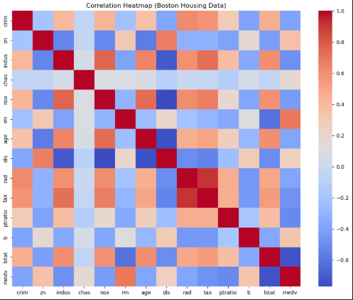

# Housing Price Analysis – Boston Area

## Table of Contents
- [Project Overview](#project-overview)
- [Datasets](#datasets)
- [Analysis](#analysis)
- [Key Findings](#key-findings)
- [Visualizations](#visualizations)
- [How to Run](#how-to-run)
- [Folder Structure](#folder-structure)
- [Acknowledgments](#acknowledgments)

  ## Project Overview
This project analyzes factors affecting housing prices in and around Boston. Using publicly available datasets, we explore how variables such as property size, location, socioeconomic indicators, and pupil-teacher ratios impact median housing values. The analysis combines exploratory data analysis, visualizations, and simple linear regression to uncover key trends and insights.

## Datasets
The project uses three datasets:  
- **BostonHousing.csv** – Classic Boston housing dataset with property features and median values.  
- **housing.csv** – Selected features like RM, LSTAT, PTRATIO, and MEDV.  
- **merged_data_final.csv** – Time-series data with housing prices across towns and counties.  

All datasets are stored in the `Data/` folder.

## Analysis
The workflow includes:  
1. **Data Cleaning:** Handling missing values and duplicates.  
2. **Exploratory Data Analysis:**  
   - Correlation heatmaps  
   - Scatter plots for key variables (`rm`, `lstat`, `ptratio`)  
   - Trends over time and location-based price differences  
3. **Linear Regression:**  
   - Predicting median housing price (`medv`) using `rm`, `lstat`, and `ptratio`.  
   - Model achieved **R² = 0.6783**, explaining ~68% of variance.  
   - Coefficients:  
     - `rm`: +4.51 → more rooms → higher prices  
     - `lstat`: -0.57 → higher lower-status population → lower prices  
     - `ptratio`: -0.93 → higher pupil-teacher ratio → lower prices

## Key Findings
- **Property size (`rm`)** is the strongest positive predictor of housing prices.  
- **Socioeconomic status (`lstat`)** has the strongest negative impact.  
- **Pupil-teacher ratio (`ptratio`)** moderately negatively impacts prices.  
- Location and seasonal trends also affect housing prices, with notable differences across towns.  
- Some neighborhoods show price anomalies, likely due to gentrification or recent developments.

## Visualizations
**Correlation Heatmap (features vs median value)**:  

Other figures (scatter plots, boxplots, trend lines) are in the `Graph/` folder.

## How to Run
1. Clone the repository.  
2. Open `Code/analysis.ipynb` in Jupyter Notebook or VS Code.  
3. Ensure all datasets are in the `Data/` folder.  
4. Run all cells to reproduce cleaning, analysis, and visualizations.

## Folder Structure

housing_analysis/
│
├── Code/ # Notebook and scripts
├── Data/ # CSV datasets
├── Graph/ # Visualizations generated from analysis
└── Report_file/ # Written report (PDF or Word)

## Acknowledgments
- Wentworth Institute of Technology for project support  
- Professor and classmates for feedback  
- Public datasets from UCI Machine Learning Repository, Kaggle, and RentData.org

